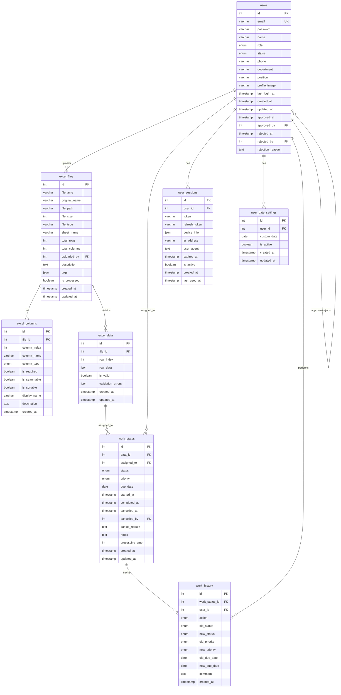

# MetroWork Database ERD (Entity Relationship Diagram)

## 📊 테이블 관계도

## 🔗 주요 관계 설명

### 1. 사용자 관리 (users)
- **자체 참조**: `approved_by`, `rejected_by` → `users.id`
- **역할**: 관리자/일반회원 구분 (`role`)
- **상태**: 승인 상태 관리 (`status`)

### 2. 엑셀 파일 관리 (excel_files)
- **업로더**: `uploaded_by` → `users.id`
- **파일 정보**: 원본명, 저장명, 경로, 크기 등
- **처리 상태**: `is_processed` 플래그

### 3. 동적 컬럼 지원 (excel_columns)
- **파일 연결**: `file_id` → `excel_files.id`
- **컬럼 정의**: 타입, 필수여부, 검색/정렬 가능 여부
- **순서**: `column_index`로 컬럼 순서 관리

### 4. 엑셀 데이터 (excel_data)
- **파일 연결**: `file_id` → `excel_files.id`
- **동적 데이터**: `row_data` JSON으로 모든 컬럼 데이터 저장
- **유효성**: `is_valid`, `validation_errors`로 데이터 검증

### 5. 업무 처리 상태 (work_status)
- **데이터 연결**: `data_id` → `excel_data.id`
- **담당자**: `assigned_to` → `users.id`
- **상태 추적**: pending → in_progress → completed
- **취소**: `cancelled_by` → `users.id`

### 6. 사용자별 날짜 설정 (user_date_settings)
- **사용자 연결**: `user_id` → `users.id`
- **커스텀 날짜**: 사용자별 "오늘 날짜" 설정
- **활성화**: `is_active` 플래그

### 7. 작업 히스토리 (work_history)
- **업무 연결**: `work_status_id` → `work_status.id`
- **작업자**: `user_id` → `users.id`
- **변경 추적**: 상태, 우선순위, 마감일 변경 기록

### 8. 사용자 세션 (user_sessions)
- **사용자 연결**: `user_id` → `users.id`
- **토큰 관리**: JWT 토큰, 리프레시 토큰
- **디바이스 정보**: IP, User-Agent 등

## 📈 주요 뷰 (Views)

### 1. user_work_summary
사용자별 업무 현황 요약
- 대기중, 진행중, 완료, 취소, 지연 건수

### 2. excel_file_summary
엑셀 파일별 데이터 현황
- 총 데이터 수, 유효/무효 데이터 수, 할당된 업무 수

### 3. today_work
오늘 할 일 (사용자별 날짜 설정 반영)
- 사용자 설정 날짜에 따른 할 일 목록

## 🔍 주요 인덱스

### 성능 최적화 인덱스
- `idx_work_status_assigned_due`: 담당자별 마감일 조회
- `idx_work_status_status_due`: 상태별 마감일 조회
- `idx_excel_data_file_valid`: 파일별 유효 데이터 조회
- `idx_users_status_role`: 승인된 사용자별 역할 조회

### 고유 제약조건
- `unique_file_column`: 파일별 컬럼 순서 고유
- `unique_file_row`: 파일별 행 번호 고유
- `unique_data_assignment`: 데이터별 담당자 고유
- `unique_user_date`: 사용자별 날짜 설정 고유

## 💡 설계 특징

### 1. 동적 컬럼 지원
- `excel_columns` 테이블로 컬럼 정의 관리
- `excel_data.row_data` JSON으로 모든 데이터 저장
- 컬럼 추가/삭제 시 스키마 변경 불필요

### 2. 확장 가능한 구조
- JSON 필드 활용으로 유연한 데이터 저장
- 뷰를 통한 복잡한 쿼리 단순화
- 히스토리 테이블로 변경 이력 추적

### 3. 성능 최적화
- 적절한 인덱스 설계
- 복합 인덱스로 자주 사용되는 쿼리 최적화
- 뷰를 통한 미리 계산된 결과 제공

### 4. 데이터 무결성
- 외래키 제약조건으로 관계 보장
- 고유 제약조건으로 중복 방지
- CASCADE/SET NULL로 일관성 유지 